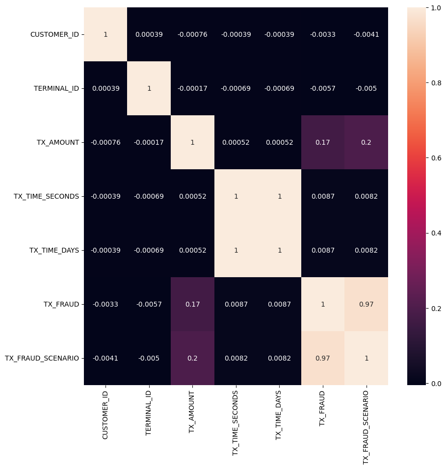

# 💳 Fraud Transaction Detection System



The Fraud Transaction Detection System is a Machine Learning project that classifies financial transactions as fraudulent or legitimate using transaction-related features. The model is trained on a simulated fraud dataset stored in multiple PKL files and uses a Random Forest Classifier for prediction.

## 🎯 Objectives

* Load and combine transaction datasets from multiple PKL files.
* Perform data preprocessing and cleaning.
* Train a machine learning model to detect fraudulent transactions.
* Evaluate model performance using classification metrics.
* Save the trained model for future use.


## 📊 Dataset Description

The dataset contains transaction records with the following features:

| Feature        | Description                             |
| -------------- | --------------------------------------- |
| TRANSACTION_ID | Unique transaction identifier           |
| TX_DATETIME    | Date and time of transaction            |
| CUSTOMER_ID    | Customer identifier                     |
| TERMINAL_ID    | Merchant terminal identifier            |
| TX_AMOUNT      | Transaction amount                      |
| TX_FRAUD       | Fraud label (0 = Legitimate, 1 = Fraud) |

The dataset is distributed across multiple daily `.pkl` files.

---

## 🛠 Technologies Used

* Python
* Pandas
* NumPy
* Scikit-learn
* Joblib
* Jupyter Notebook


## 🤖 Machine Learning Algorithm

### Random Forest Classifier

The Random Forest algorithm was selected because it:

* Handles large datasets efficiently.
* Works well with tabular transaction data.
* Reduces overfitting through ensemble learning.
* Provides strong classification performance.


## 🔄 Project Workflow

Load PKL Files

↓

Combine Daily Transaction Files

↓

Data Cleaning & Preprocessing

↓

Feature Selection

↓

Train-Test Split

↓

Random Forest Training

↓

Fraud Prediction

↓

Model Evaluation

↓

Model Saving


## 📈 Model Performance

| Metric          | Score  |
| --------------- | ------ |
| Accuracy        | 99.37% |
| Fraud Precision | 1.00   |
| Fraud Recall    | 0.23   |
| Fraud F1-Score  | 0.37   |

The model achieved very high overall accuracy. However, fraud detection remains challenging due to the highly imbalanced nature of the dataset.


## 📂 Project Structure

Fraud-Transaction-Detection/


├── frauddetection.ipynb

├── README.md

└── Image.png


## 🚀 Installation

```bash
pip install pandas numpy scikit-learn joblib
```

## ▶️ Usage

Open the Jupyter Notebook:

```bash
jupyter notebook
```

Run all notebook cells to:

* Load and combine PKL files.
* Train the Random Forest model.
* Evaluate performance.
* Save the trained model.


